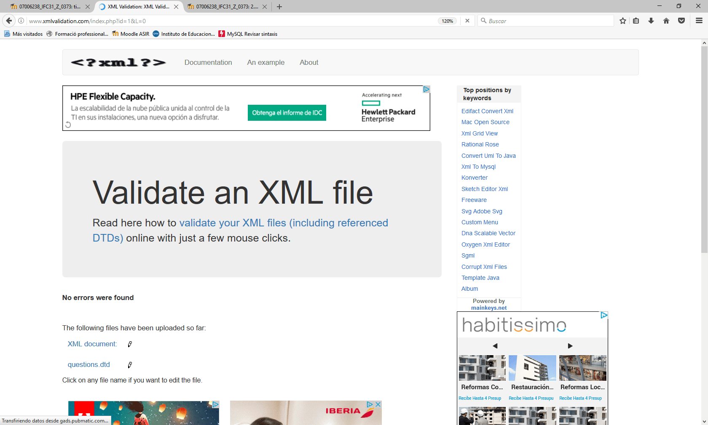
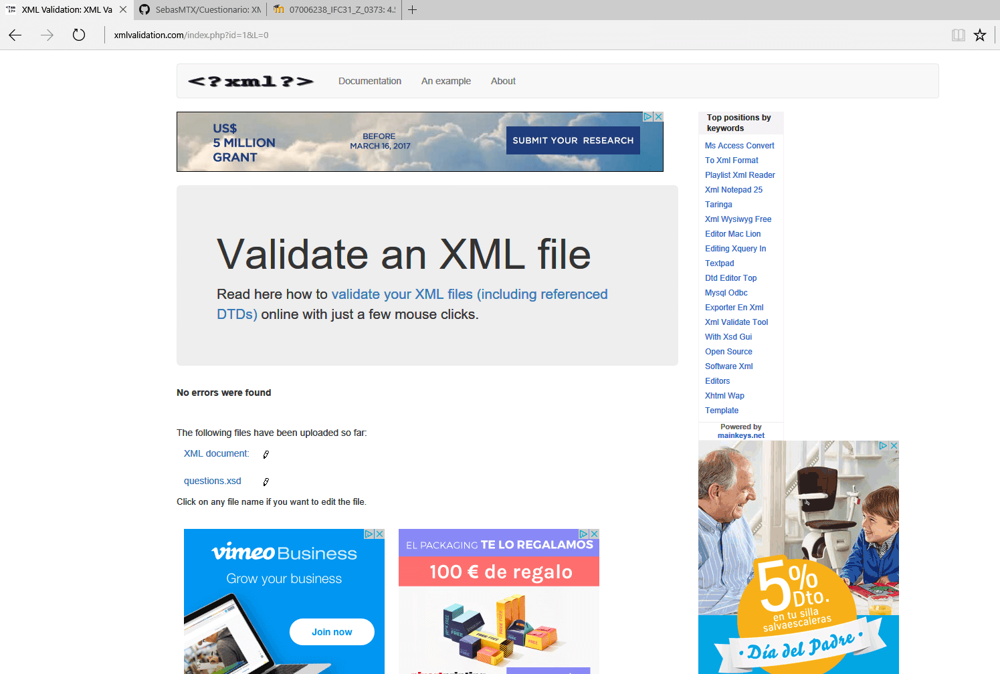

# V1.0 Cuestionario XML y DTD

Como primera parte de la tarea se ha creado un archivo _xml_ que contiene 10 preguntas con 5 tipos de formulario:
  
  * **_Radio_**: Se podrá seleccionar la respuesta correcta entre muchas.
  * **_Text_**: Se deberá intruducir un texto para responder.
  * **_Checkbox_**: Se seleccionará la opción correcta entre muchas.
  * **_Select_**: Se elegirá la respuesta correcta entre muchas.
  * **_Multiple_**: Se deberán seleccionar todas las respuestas correctas.

Finalizado el _xml_ se validará mediante un documento _dtd_ que crearemos al efecto.
La funcionalidad del documento _dtd_ se comprueba a través de la web www.xmlvalidation.com, verificando que se halla bien formado y sin errores:

  

Así mismo, como requisitos, el fichero _xml_ debe:
  
  * Contener la etiqueta raíz _questions_, la cual contiene múltiples _question_ con sus respectivos _id_ y los siguientes elementos:
  
    * **_type_** con uno de los valores antes mencionados.
    * **_title_** con un _pcdata_ de forma obligatoria.
    * **_option_** que puede tener 0, 1 o más _pcdata_.
    * **_answer_** que puede tener 1 o más _pcdata_.
    
Ambos archivos creados (_questions_dtd.xml_ y _questions.dtd_) se hallan incorporados al presente _Github_.

# V1.1 Cuestionario XML y XSD

Usando el mismo cuestionario anterior, se deberá crear un archivo _XML Schema Definition (documento XSD)_ describiendo la estructura del documento _XML_ y que lo valide.
Nuevamente se comprueba la funcionalidad del documento _xsd_ generado a través de la web www.xmlvalidation.com, verificando su correcta estructura y ausencia de errores:

 

Ambos archivos creados (questions_xsd.xml y questions.xsd) se hallan incorporados al presente Github.

# V1.2 Cuestionario HTML, XML y Javascript

Se incorporan tres archivos HTML vinculados entre ellos mediante un menú lateral y que contienen:

* **_inicio.html_**: Página principal con las instrucciones del funcionamiento de la página y el acceso al formulario.
* **_test.html_**: Página que contiene el formulario, referenciado al _xml_ y con los 5 tipos de pregunta detallados en la versión V1.0.
* **_contacto.html_**: Página que posibilita el contacto con el autor. **ACTUALMENTE NO FINALIZADA**

Así mismo se incorpora una neva carpeta (_js_) que contiene el código _JavaScript_ que combina la información contenida en la página _XML_ con los selectores apropiados en la página _test.html_ con el fin de presentar adecuadamente el formulario. Al mismo tiempo el código _JavaScript_ realizará la corrección de cada una de las preguntas y presentará un resultado.

# V1.3 Cuestionario final HTML, CSS, XML y Javascript

Se incorpora a la nueva carpeta _css_ dos hojas, debidamente vinculadas en todos los _html_, que dotarán de estilo a todas las páginas de la web:

* **_d.css_**: Hoja de estilo para pantallas tipo pc.
* **_m.css_**: Hoja de estilo para dispositivos móviles.

Al mismo tiempo que se realizan los ajustes de estilo se incorpora un logotipo identificativo en todos los _html_, cuya imagen se guarda en la carpeta _img_.

Se identa todo el código creado y se valida a través de las webs _https://validator.w3.org/_ y _https://jigsaw.w3.org/css-validator/_, verificando la ausencia de errores de sintaxis.

Finalizada la construcción del formulario se crea una nueva _branch_ en Github que contiene una versión _minified_.

**La tarea se halla incompleta debido a sucesivos errores en el código _JavaScript_ en los intentos de implementar la corrección de las preguntas tipo _radio_**
