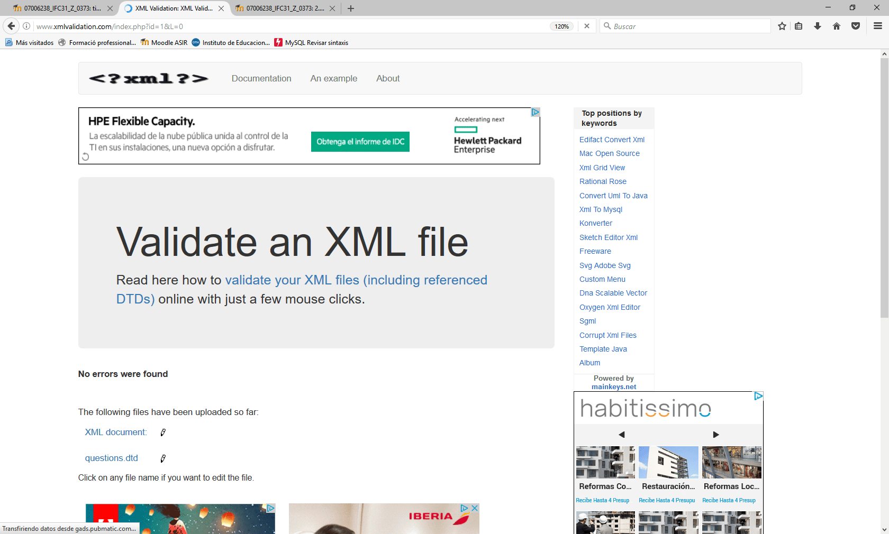

# Cuestionario

  Como primera parte de la tarea se ha creado un archivo _xml_ que contiene 10 preguntas con 5 tipos de formulario:
  
  * _Radio_: Se podrá seleccionar la respuesta correcta entre muchas.
  * _Text_: Se deberá intruducir un texto para responder.
  * _Checkbox_: Se seleccionará la opción correcta entre muchas.
  * _Select_: Se elegirá la respuesta correcta entre muchas.
  * _Multiple_: Se deberán seleccionar todas las respuestas correctas.

  Finalizado el _xml_ se validará mediante un documento _dtd_ que crearemos al efecto.
  La funcionalidad del documento _dtd_ se comprueba a través de la web www.xmlvalidation.com, verificando que se halla bien formado y sin errores:

  

  Así mismo, como requisitos, el fichero _xml_ debe:
  
  * Contener la etiqueta raíz _questions_, la cual contiene múltiples _question_ con sus respectivos _id_ y los siguientes elementos:
  
    * _type_ con uno de los valores antes mencionados.
    * _title_ con un _pcdata_ de forma obligatoria.
    * _option_ que puede tener 0, 1 o más _pcdata_.
    * _answer_ que puede tener 1 o más _pcdata_.
    
  Ambos archivos creados (_questions.xml_ y _questions.dtd_) se hallan incorporados al presente _Ghitub_.
